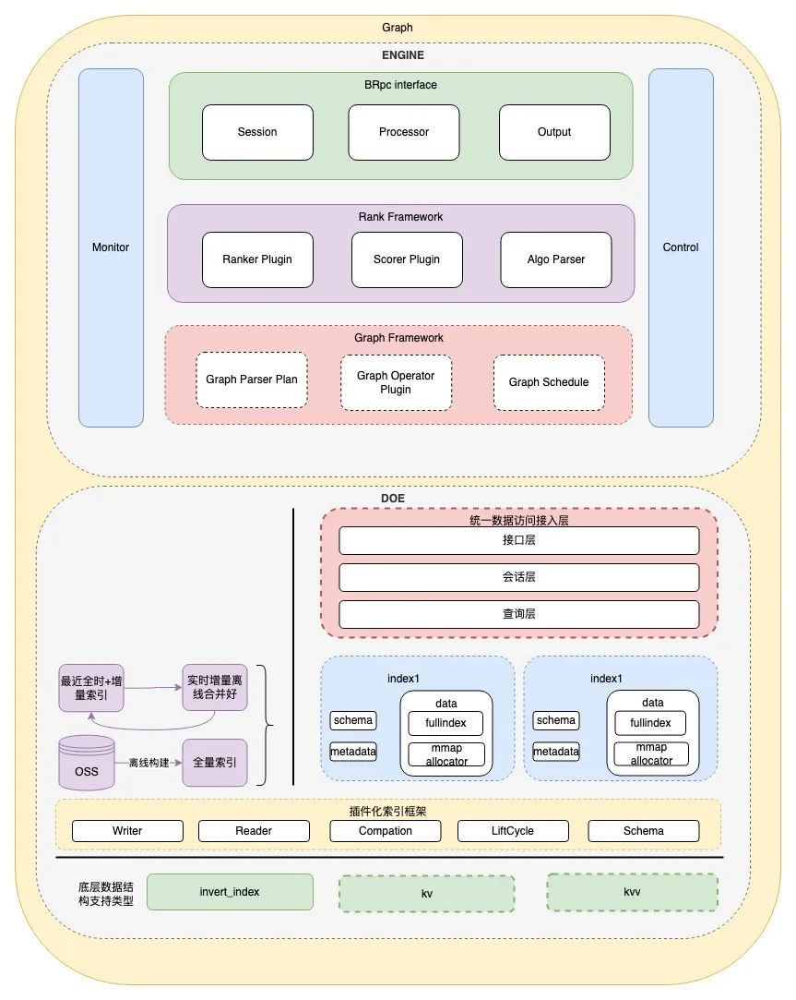

  <h1 align="center">Dgraph 分布式图数据库</h1>
  

    <a href="README.md"><strong>English</strong></a> | <strong>简体中文</strong>
  

## 目录

- [仓库简介](#项目介绍)
- [前置条件](#前置条件)
- [镜像说明](#镜像说明)
- [获取帮助](#获取帮助)
- [如何贡献](#如何贡献)

## 项目介绍
‌[Dgraph‌](https://github.com/hypermodeinc/dgraph) Dgraph 是一个开源的、分布式的 原生图数据库（Native Graph Database），专为高效存储和查询高度关联的数据而设计。它采用 GraphQL-like 查询语言（DQL），并提供水平扩展能力，适用于社交网络、推荐系统、知识图谱等复杂关系场景。

**核心特性：**
1. 原生图数据库设计：Dgraph 是专为图数据构建的分布式数据库，采用有向属性图模型，支持节点（实体）、边（关系）和属性（键值对）的灵活建模。例如 Person-(FRIEND)->Person{name:"Alice"} 可直接表示社交关系网络，天然适合复杂关联查询。
2. 高性能分布式架构：基于 Raft共识协议 实现多节点数据一致性，支持水平扩展。通过数据分片（Sharding） 和 并行查询执行，可处理千亿级节点和边的实时遍历，吞吐量随集群规模线性增长。
3. GraphQL+-查询语言：提供类GraphQL的声明式查询语言（语法兼容GraphQL但扩展了图操作能力），支持深度链接查询、过滤、分页和聚合。
4. ACID事务支持：保证跨节点的强一致性读写，支持快照隔离级别。事务可批量操作多个节点/边，例如同时更新用户信息和好友关系，确保数据完整性。
5. 实时增量备份与恢复：通过Export/Import机制实现全量备份，结合WAL（Write-Ahead Log） 支持增量数据同步，灾难恢复时可快速回滚到指定时间点。
6. 多语言客户端支持：官方提供 Go、Java、Python、JavaScript 等语言的客户端驱动，同时兼容gRPC和HTTP API，便于集成到现有技术栈。
7. 智能索引与查询优化：自动为常用查询字段（如@id、@index）创建优化索引，支持全文检索（@fulltext）、模糊匹配和地理空间查询。查询计划器动态优化执行路径，减少图遍历开销。
8. 云原生与Kubernetes集成：提供Helm Chart和Operator简化K8s部署，支持动态扩缩容、健康检查和监控指标暴露（Prometheus格式），适合云环境下的弹性需求。
9. 细粒度权限控制：基于JWT或自定义鉴权逻辑实现字段级访问控制（如限制用户只能查询自己的好友数据），满足GDPR等合规要求。
10. 实时订阅（Live Queries）：客户端可订阅图数据变更事件（如新添加的节点或边），实时推送更新到前端应用，适用于社交动态、欺诈检测等场景。

本项目提供的开源镜像商品 [**`Dgraph-分布式图数据库`**](https://marketplace.huaweicloud.com/hidden/contents/bdfcaa10-f7dc-4727-8b80-e72531a74308#productid=OFFI1146358445895069696)，已预先安装 Dgraph 软件及其相关运行环境，并提供部署模板。快来参照使用指南，轻松开启“开箱即用”的高效体验吧。

**架构设计：**

> **系统要求如下：**
> - CPU: 4vCPUs 或更高
> - RAM: 16GB 或更大
> - Disk: 至少 50GB

## 前置条件
[注册华为账号并开通华为云](https://support.huaweicloud.com/usermanual-account/account_id_001.html)

## 镜像说明

| 镜像规格                                                                                                                        | 特性说明 | 备注 |
|-----------------------------------------------------------------------------------------------------------------------------| --- | --- |
| [Dgraph24.1.3-arm-v1.0](https://github.com/HuaweiCloudDeveloper/dgraph-image/tree/Dgraph24.1.3-arm-v1.0?tab=readme-ov-file) | 基于鲲鹏服务器 + Huawei Cloud EulerOS 2.0 64bit 安装部署 |  |

## 获取帮助
- 更多问题可通过 [issue](https://github.com/HuaweiCloudDeveloper/dgraph-image/issues) 或 华为云云商店指定商品的服务支持 与我们取得联系
- 其他开源镜像可看 [open-source-image-repos](https://github.com/HuaweiCloudDeveloper/open-source-image-repos)

## 如何贡献
- Fork 此存储库并提交合并请求
- 基于您的开源镜像信息同步更新 README.md