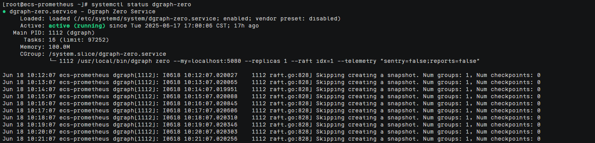
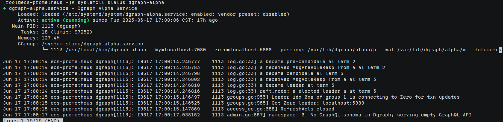
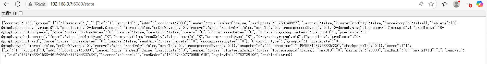
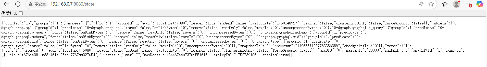
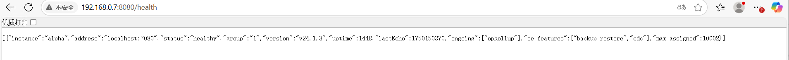

# Dgraph 使用指南

# 商品链接

[Dgraph-分布式图数据库]()

# 商品说明

Dgraph 是一个开源的、分布式的 原生图数据库（Native Graph Database），专为高效存储和查询高度关联的数据而设计。它采用 GraphQL-like 查询语言（DQL），并提供水平扩展能力，适用于社交网络、推荐系统、知识图谱等复杂关系场景。

# 商品购买

您可以在云商店搜索 **dgraph**。

其中，地域、规格、推荐配置使用默认，购买方式根据您的需求选择按需/按月/按年，短期使用推荐按需，长期使用推荐按月/按年，确认配置后点击“立即购买”。

# 商品资源配置

商品支持 **ECS 控制台配置**，下面对资源配置的方式进行介绍。

## ECS 控制台配置

### 准备工作

在使用ECS控制台配置前，需要您提前配置好 **安全组规则**。

> **安全组规则的配置如下：**
> - 入方向规则放通端口 `5080`、`6080`、`7080`、`8080`、`9080`，**源地址内必须包含您的客户端 ip**，否则无法访问
> - 入方向规则放通 CloudShell 连接实例使用的端口 `22`，以便在控制台登录调试
> - 出方向规则一键放通

### 创建ECS

前提工作准备好后，选择 ECS 控制台配置跳转到购买 ECS 页面，ECS 资源的配置如下图所示：

> **值得注意的是：**
> - VPC 您可以自行创建
> - 安全组选择 [**准备工作**](#准备工作) 中配置的安全组；
> - 弹性公网IP选择现在购买，推荐选择“按流量计费”，带宽大小可设置为5Mbit/s；
> - 高级配置需要在高级选项支持注入自定义数据，所以登录凭证不能选择“密码”，选择创建后设置；
> - 其余默认或按规则填写即可。

# 商品使用

## Dgraph 使用

### 验证dgraph-zero服务状态

systemctl status dgraph-zero

### 验证dgraph-alpha服务状态

systemctl status dgraph-alpha

### 获取Zero节点集群拓扑状态

http://ip:6080/state

### 检查Zero节点健康状态

http://ip:6080/health

### 获取Alpha节点集群拓扑状态

http://ip:8080/state

### 检查Alpha节点健康状态

http://ip:8080/health

### 参考文档

[Dgraph官网](https://dgraph.io)